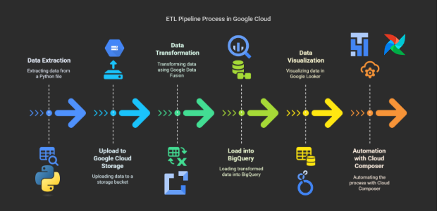

# GCP Data Warehousing

This repository contains the code and setup for a <strong> Data Pipeline</strong> built using <strong>Google Cloud Platform services</strong>. The pipeline <strong>extracts, transforms, and loads (ETL)</strong> data into <strong>Google Cloud Storage (GCS)</strong>, processes it using <strong>Cloud Data Fusion</strong>, and stores it in <strong>BigQuery</strong> for analysis. Additionally, the processed data is visualized in <strong>Google Looker</strong> for reporting and insights.

## Table of Contents
- [Project Description](#project-description)
- [System Architecture](#system-architecture)
- [Prerequisites](#prerequisites)
- [Setup Instructions](#setup-instructions)
- [Usage](#usage)
- [Technologies Used](#technologies-used)
- [Cloud Services Involved](#cloud-services-involved)
- [Looker Dashboard](#looker-dashboard)
- [Contributing](#contributing)
- [License](#license)

## Project Description

This project automates the ETL pipeline using the following services:

- <strong>Google Cloud Storage (GCS) </strong>for data storage
- <strong>Cloud Composer (Apache Airflow) </strong> to orchestrate tasks
- <strong>Cloud Data Fusion </strong> to trigger and manage ETL pipelines
- <strong>BigQuery </strong> for data warehousing
- <strong>Google Looker </strong> for creating data visualizations and dashboards

The pipeline runs on a daily schedule to process data from raw to actionable insights. Once the data is processed, it is visualized in Looker for business analysis.

## System Architecture


This ETL pipeline extracts data from a Python script and uploads it to a Google Cloud Storage (GCS) bucket. The data is then ingested by Google Cloud Data Fusion, where it is transformed and loaded into Google BigQuery for warehousing. From BigQuery, the processed data is fetched into Google Looker for reporting and dashboard creation. The entire process is automated using Google Cloud Composer (Apache Airflow), orchestrating the extraction, transformation, and loading (ETL) tasks to ensure a seamless and scheduled data pipeline from raw to insightful data.

## Prerequisites

Before you begin, ensure the following:
<ul>
<li>A Google Cloud Project is set up with permissions to use GCS, BigQuery, Cloud Composer, Cloud Data Fusion, and Looker.</li>
<li>Google Cloud SDK (gsutil) is installed and configured.</li>
<li>Access to Google Cloud Composer for managing workflows.</li>
<li>Service account with roles such as <b>Storage Object Admin, BigQuery Admin, Data Fusion Admin,</b> and others necessary for your pipeline.</li>

## Setup Instructions

1. Clone the repository:
```bash
git clone https://github.com/your-username/generic-data-pipeline.git
cd generic-data-pipeline
```

2. Create a `.env` file to store your environment variables:
```env
PROJECT_ID=your-project-id
BUCKET_NAME=your-bucket-name
LOCAL_FILE_PATH=/path/to/your/data.csv
GCS_FOLDER_NAME=your-folder-name
GCS_FILE_NAME=your-file-name.csv
GOOGLE_CREDENTIALS_PATH=/path/to/your/service-account-file.json
```

3. Deploy the DAG in Cloud Composer:
   - Upload the DAG and Python scripts to the DAGs folder in Cloud Composer
   - Ensure the proper permissions for the Cloud Composer environment

4. Verify the setup:
   - Ensure your Google Cloud Composer environment is running
   - Verify the pipeline triggers according to the defined schedule
   - Use Cloud Logging to monitor the status and troubleshoot any issues

## Usage

The pipeline runs automatically based on the defined schedule (@daily). The following tasks are executed:

1. Check if the configuration file exists in GCS
2. Download the configuration file from GCS to Cloud Composer
3. Run a Python script that processes the data and uploads it to GCS
4. Start the Cloud Data Fusion pipeline to process the data and load it into BigQuery
5. Once the data is loaded into BigQuery, it can be visualized using Google Looker

## Technologies Used

- Google Cloud Platform (GCP)
- Google Cloud Storage (GCS)
- Google Cloud Composer (Apache Airflow)
- Cloud Data Fusion
- BigQuery
- Looker
- Python for scripting
- Bash commands for interacting with GCS and Cloud Composer
- dotenv for managing environment variables

## Cloud Services Involved

- **Google Cloud Storage (GCS)**: Stores raw and processed data
- **Cloud Composer (Apache Airflow)**: Orchestrates pipeline tasks
- **Cloud Data Fusion**: Triggers and manages the ETL pipeline
- **BigQuery**: Stores processed data for analysis
- **Looker**: Provides data visualizations and dashboards

## Looker Dashboard

A Looker Dashboard has been created to visualize the processed data in BigQuery. The dashboard includes:

### Features
- Data Visualizations: Display key metrics, trends, and summaries
- Reports: Generate custom reports based on the processed data
- Interactive Filters: Allows users to filter and drill down into specific data segments

### How to Use the Dashboard
1. Access the Dashboard: Log in to Looker using your credentials
2. Explore: Navigate to the dashboard under the designated folder
3. Filters: Apply filters to analyze data according to specific parameters

## Contributing

If you would like to contribute, please follow these steps:

1. Fork the repository
2. Create a new branch (`git checkout -b feature-branch`)
3. Make your changes and commit them (`git commit -m 'Add feature'`)
4. Push to the branch (`git push origin feature-branch`)
5. Create a pull request and describe your changes

## License

This project is licensed under the MIT License - see the [LICENSE](LICENSE) file for details.

## Additional Notes

- The pipeline can be extended to integrate additional data sources or process real-time data using Google Pub/Sub
- Looker dashboards can be customized further to include more visualizations or interactive components based on the data